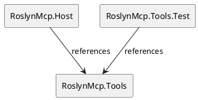
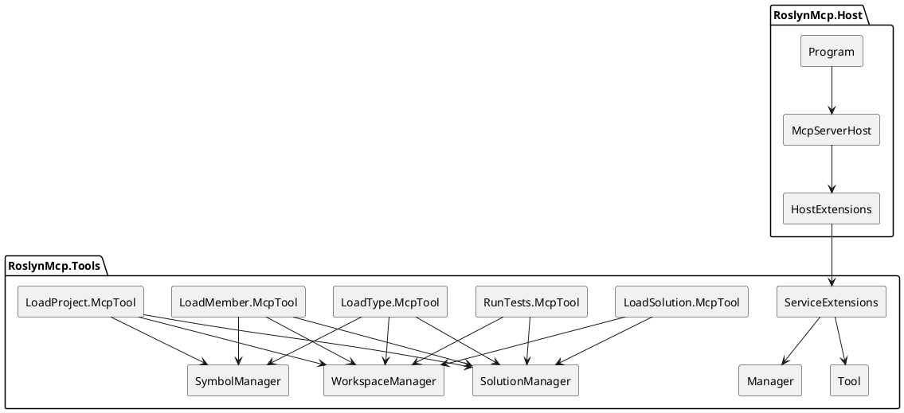
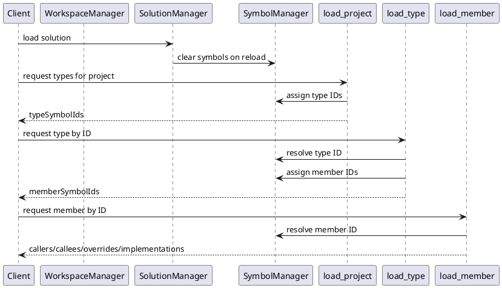
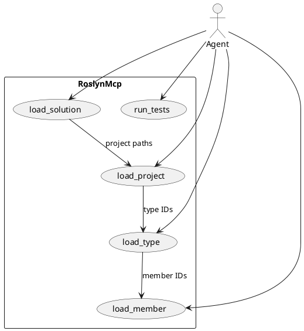

# RoslynMcp 1.0.0 — Architecture Sketch

This document sketches the current architecture of `RoslynMcp` 1.0.0.

It focuses on system shape, responsibilities, and the main runtime flow.

---

## 1. High-level structure

The solution is intentionally small and centered around one core project.

- `RoslynMcp.Tools`
  - contains the actual MCP tool implementations
  - contains shared managers and symbol/path models
- `RoslynMcp.Host`
  - thin runtime host
  - composes services and exposes the tool set through MCP
- `RoslynMcp.Tools.Test`
  - verifies the tool surface directly

### PlantUML — project structure

---

## 2. Architectural intent

The architecture is tools-first.

The important design move in `1.0.0` is that the codebase no longer spreads core behavior across multiple layered projects. Instead, the semantic MCP surface lives together in `RoslynMcp.Tools`, while `RoslynMcp.Host` mainly performs runtime composition.

That gives the system three clear qualities:

1. **The tool surface is the product**
2. **The host is mostly composition**
3. **Tests target the real tool layer directly**

---

## 3. Main building blocks

## 3.1 Host layer

The host layer is small.

### `Program`

- process entry point
- installs cancellation handling
- delegates startup to `McpServerHost.RunAsync(...)`

### `McpServerHost`

- starts the server runtime
- depends on the host composition path

### `HostExtensions`

- central composition entry point
- exposes `Compose(IServiceCollection services)`
- wires:
  - `WithRoslynMcp()` from the tools project
  - MCP runtime registration
  - MCP server transport and tool exposure

This means the host does not own business logic.
It owns bootstrapping.

---

## 3.2 Tools layer

`RoslynMcp.Tools` is the center of the system.

It contains four kinds of things:

1. **tool entry points**
2. **managers**
3. **symbol/result models**
4. **supporting extensions / execution helpers**

### Marker types

- `Tool`
- `Manager`

These are lightweight markers used for discovery and registration.

### Registration pattern

`ServiceExtensions` scans the assembly and registers concrete implementations of:

- `Manager`
- `Tool`

So the architecture avoids manual one-by-one wiring of every tool type.

### PlantUML — composition view

---

## 4. Managers and shared state

The managers are the stable center of the runtime model.

## 4.1 `WorkspaceManager`

Responsibility:

- tracks the current workspace directory
- normalizes target paths
- converts relative/absolute paths
- discovers solution files

Architecturally, this is the boundary between MCP input paths and the file system view used by the tools.

## 4.2 `SolutionManager`

Responsibility:

- opens a Roslyn solution through `MSBuildWorkspace`
- stores the current loaded `Solution`
- tracks a workspace/session version
- reloads and applies solution changes
- clears symbol state when the solution changes

This is the stateful semantic root of the tool layer.

Important detail:

- tool operations depend on the currently loaded solution
- solution reload invalidates prior symbol identity assumptions

## 4.3 `SymbolManager`

Responsibility:

- maps Roslyn `ISymbol` instances to stable session IDs
- maps IDs back to symbols for later tool calls
- distinguishes type IDs and member IDs

This manager is the bridge that makes multi-step symbolic navigation possible:

- `load_project` returns type IDs
- `load_type` consumes type IDs and returns member IDs
- `load_member` consumes member IDs

Without this manager, the tools would not have a stable symbol handoff protocol.

### PlantUML — state flow

---

## 5. Tool surface

The public semantic workflow is compact and sequential.

## 5.1 `load_solution`

Purpose:

- enter a solution context
- discover or resolve the solution path
- load the solution into the session
- return a project graph summary

Dependencies:

- `WorkspaceManager`
- `SolutionManager`

Output role:

- establishes the semantic session root

## 5.2 `load_project`

Purpose:

- inspect one project inside the loaded solution
- enumerate declared types
- assign stable type IDs

Dependencies:

- `WorkspaceManager`
- `SolutionManager`
- `SymbolManager`

Output role:

- creates the first navigable symbol layer

## 5.3 `load_type`

Purpose:

- inspect one type by symbol ID
- return:
  - the type itself
  - documentation summary
  - derived types
  - implementations
  - declared members

Dependencies:

- `WorkspaceManager`
- `SolutionManager`
- `SymbolManager`

Output role:

- expands project-level discovery into type-level navigation

## 5.4 `load_member`

Purpose:

- inspect one member by symbol ID
- return:
  - the member itself
  - documentation
  - callers
  - callees
  - overrides
  - implementations

Dependencies:

- `WorkspaceManager`
- `SolutionManager`
- `SymbolManager`

Output role:

- exposes semantic behavior edges

## 5.5 `run_tests`

Purpose:

- run tests against the current solution or an explicit target
- reuse loaded solution context when no explicit target is given

Dependencies:

- `WorkspaceManager`
- `SolutionManager`

Output role:

- validates behavioral expectations at the solution boundary

---

## 6. Main runtime flow

The intended flow is narrow and deliberate.

1. `load_solution`
2. `load_project`
3. `load_type`
4. `load_member`
5. `run_tests`

This sequence mirrors the architecture:

- first establish context
- then discover types
- then inspect one type
- then inspect one behavior-bearing member
- then validate with tests

### PlantUML — main user flow

---

## 7. Why this architecture works well

This design is strong because it keeps the semantic workflow explicit.

### Benefits

- small project graph
- low host complexity
- direct tool discoverability
- stable symbol handoff across tool calls
- testability at the tool layer
- semantic navigation instead of text-only search

### Tradeoff

The architecture is optimized for symbolic understanding, not for raw textual inspection.

That is a good trade if the product goal is:

- code intelligence
- semantic navigation
- agent-facing exploration

---

## 8. Mental model in one sentence

`RoslynMcp` 1.0.0 is a thin MCP host wrapped around a stateful Roslyn tool kernel whose managers maintain workspace, solution, and symbol identity across a guided semantic navigation workflow.

---

## 9. Practical reading guide

If you want to understand the codebase quickly, the best order is:

1. `RoslynMcp.Host`
   - `Program`
   - `McpServerHost`
   - `HostExtensions`
2. `RoslynMcp.Tools`
   - `Extensions/ServiceExtensions`
   - `Managers/WorkspaceManager`
   - `Managers/SolutionManager`
   - `Managers/SymbolManager`
3. tool entry points
   - `Inspection/LoadSolution/McpTool`
   - `Inspection/LoadProject/McpTool`
   - `Inspection/LoadType/McpTool`
   - `Inspection/LoadMember/McpTool`
   - `Inspection/RunTests/McpTool`

That path follows the actual runtime shape of the system.
