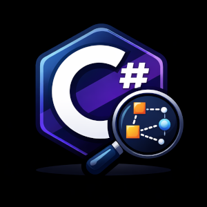
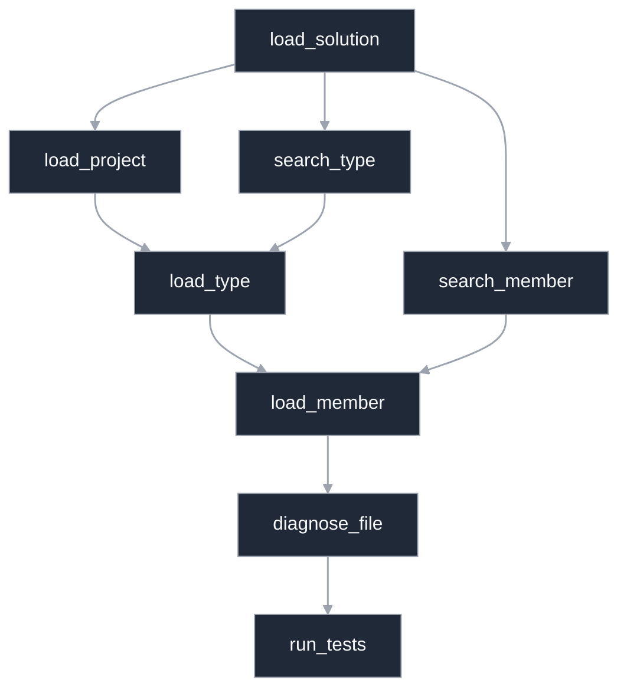

# RoslynMcp

A Model Context Protocol (MCP) server that brings Roslyn code intelligence to AI agents.


## Get It on NuGet

[](https://www.nuget.org/packages/RoslynMcp/)
[](https://www.nuget.org/packages/RoslynMcp/)

_This project uses Roslynator, licensed under Apache 2.0._

#### Installation

```bash
dotnet tool install -g RoslynMcp
```

#### Update

```bash
dotnet tool update -g RoslynMcp
```


#### MCP config (OpenCode)

```json
  "mcp": {
    "roslyn": {
      "type": "local",
      "command": [
        "roslynmcp"
      ]
    }
  }
```


## What It Is

RoslynMcp is a .NET application that exposes the power of [Roslyn](https://github.com/dotnet/roslyn) (the .NET compiler platform) through the MCP protocol. It acts as a bridge between AI assistants and your C# codebase, enabling deep code understanding and analysis.

## Why It Exists

Traditional AI code assistants often rely on simplistic pattern matching (grep/glob) which misses semantic context. RoslynMcp solves this by providing:

- **Semantic understanding** — It knows what your code *means*, not just what it *says*
- **Symbol resolution** — Understands types, methods, properties across your entire solution
- **Call graph tracing** — See how code flows through your system

## Recommended Workflows

Choose the entry point based on what you already know.



This keeps navigation semantic and symbol-aware without relying on text-only search, while still giving you fast search and file-level validation when you need it.

The full tool descriptions can be [found here](https://github.com/chrismo80/RoslynMcp/blob/main/TOOLS.md)
